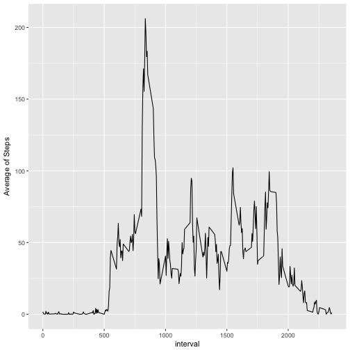
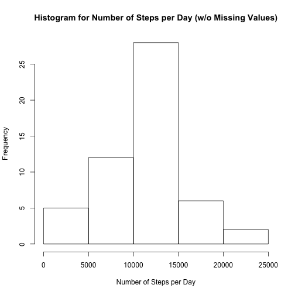
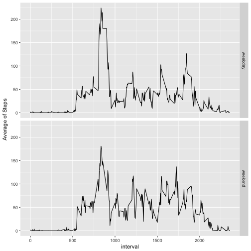

# Reproducible Research : Course Project - 1


## Loading and preprocessing the data :


```r
activity <- read.csv("./activity.csv")
```


## What is mean total number of steps taken per day?

* Calculation of total steps per day


```r
steps_per_day <- aggregate(steps ~ date,activity,sum,na.rm=TRUE)
options(scipen=999)
```

* Histogram of Total Steps for each day 


```r
hist(steps_per_day$steps,main="Histogram for Number of Steps per Day", xlab="Number of Steps per Day" )
```


* The average steps per day are 10766 and the median is 10765


## What is the average daily activity pattern?

* Calculation of mean steps per interval


```r
mean_steps_per_interval <- aggregate(steps ~ interval,activity,mean,na.rm=TRUE)
```

* Time series plot of the 5-minute interval (x-axis) and the average number of steps taken, averaged across all days (y-axis)


```r
library("ggplot2")
ggplot(mean_steps_per_interval, aes(interval,steps)) + geom_line() + ylab("Average of Steps")
```



* Calculation of interval with maximum steps


```r
max_interval <- mean_steps_per_interval[which(mean_steps_per_interval$steps == max(mean_steps_per_interval$steps)),1]

max_steps <- mean_steps_per_interval[which(mean_steps_per_interval$steps == max(mean_steps_per_interval$steps)),2]
```

* The interval with the maximun number of steps is the interval with id : 835, which contains 206 steps.


## Imputing missing values

* Calculation of rows with missing values


```r
rows_missing <- nrow(activity[which(is.na(activity$steps)),])
```

* The number of rows with missing values is : 2304.

* A new data set will be created without missing values "activity_nm". The missing values of * activity_nm will be replaced by the mean value of the corresponding 5 minute interval,     stored in data set mean_steps_per_interval created earlier.


```r
activity_nm <- activity

for(i in 1:nrow(activity_nm)){
  if(is.na(activity_nm[i,3])){
    	for (j in 1:nrow (mean_steps_per_interval)) {
    		if(activity_nm[i,1] == mean_steps_per_interval[j,1]){
    		  activity_nm[i,1] <- mean_steps_per_interval[j,1]
    		}
    	}
  }
}
```

* Aggregation of new data set "activity_pr" and plotting 


```r
steps_per_day_nm <- aggregate(steps ~ date,activity_nm,sum,na.rm=TRUE)
options(scipen=999)

hist(steps_per_day_nm$steps,main="Histogram for Number of Steps per Day (w/o Missing Values)", xlab="Number of Steps per Day" )
```




* The average steps per day (w/o missing values) is :10766 and the median (w/o missing values) : 10765. Both values are equal to the ones from first part of the assignment (data set with missing values), thus imputting  missing values had no effect on the estimates of total daily number of steps.


## Are there differences in activity patterns between weekdays and weekends?

* Creation of New factor variable named WeekPeriod containing info of day type (weekday/weekend) and binding to activity_nm data set  


```r
options(warn=-1)

activity_nm$date <- as.Date(activity_nm$date, format = "%Y-%m-%d")

weekdays_range <- c("Monday","Tuesday","Wednsday","Thursday","Friday")

activity_nm <- cbind(activity_nm,WeekPeriod =as.factor(ifelse(weekdays(activity_nm$date) %in% weekdays_range,"weekday","weekend")))
```

* Aggregation of data set activity_nm (no missing values) per Week period and interval and plotting.


```r
steps_wPeriod_interval_nm <- aggregate(steps ~ interval + WeekPeriod,activity_nm,mean,na.rm=TRUE)

ggplot(steps_wPeriod_interval_nm, aes(interval,steps)) + geom_line() + ylab("Average of Steps") + facet_grid(steps_wPeriod_interval_nm$WeekPeriod ~.)
```




